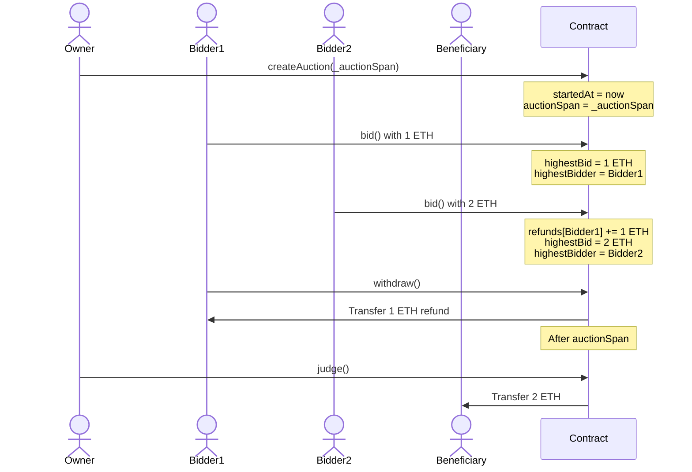

**Specification**
### Methods

#### `bid(amount)`

**Purpose:**  
Place a bid during the active auction period.

**Conditions:**  
- Must be called before the auction’s end time.  
- `amount` must be strictly greater than all previous bids.

**Effects:**  
- Updates the current highest bid and highest bidder if this bid is higher than the current highest bid.  
- The former highest bidder’s funds become withdrawable.

**Testable Properties:**  
-  succeeds and updates state when `amount` is greater than the current highest bid and called before end time.  
- fails or reverts when `amount` is not greater than the current highest bid.  
- fails or reverts when called after the auction end time.

#### `settle()`

**Purpose:**  
Finalize the auction once it has ended.

**Conditions:**  
- Must be called after the auction end time.  
- Can only be called once.
- every one can call this function(permissonless)

**Effects:**  
- Transfers the highest bid to the beneficiary.  
- Marks the auction as settled, preventing further state changes.

**Testable Properties:**  
- `settle()` fails or reverts if called before the end time.  
- `settle()` succeeds after the end time, transferring the highest bid to the beneficiary.  
- Subsequent calls to `settle()` after successful execution fail or revert.

#### `withdraw()`

**Purpose:**  
Allow non-winning bidders to reclaim their previously outbid funds.

**Conditions:**  
- Caller must have a positive, withdrawable balance.  
- Can be called at any time after being outbid.

**Effects:**  
- Transfers the caller’s withdrawable amount back to them.  
- Resets their withdrawable balance to zero.

**Testable Properties:**  
- `withdraw()` for an address with no withdrawable amount should fail or revert.  
- `withdraw()` for an address with a positive withdrawable amount transfers the correct amount and resets their balance to zero.  
- Calling `withdraw()` multiple times after the balance is reset to zero fails or reverts as no funds remain.

### sequese

