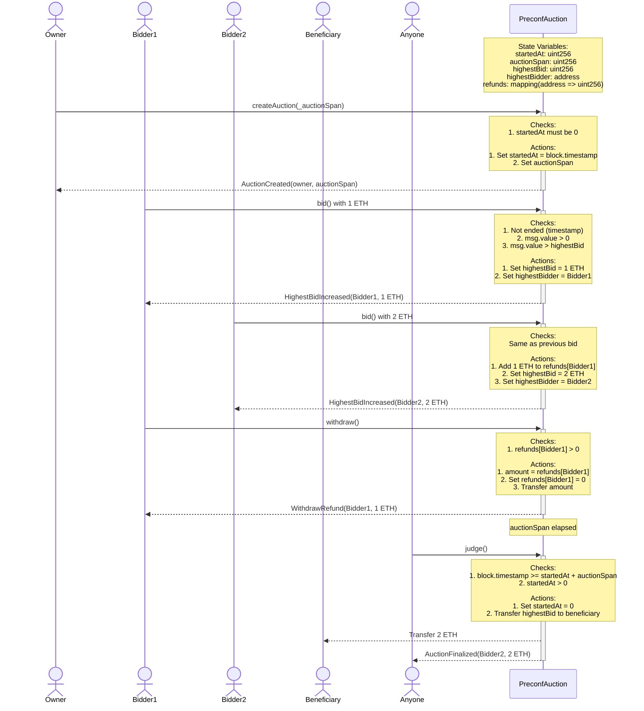

### Overview
This auction updates the highest bid amount whenever a new bid is received. If a1 is the highest bid at a certain point and a2>a1, a2's bid amount is stored as `highestBid`, a2's sender becomes the `highestBidder`, and a1 is stored in `refunds`.
The auction can set `auctionSpan` at its start, and time control for bid acceptance and settlement is performed through calculations between `startedAt` (also set at start) and block.timestamp.
During settlement, the highest bidder's bid amount is transferred to an address declared as `beneficiary`.
Accounts that no longer hold the highest bid can withdraw their bid amount from the contract at any time.

### Basic Auction Flow

1. **Starting the Auction**:  
   The auction can be started by recording the following information:  
   - Auction start time (`startedAt`)  
   - Auction duration (`auctionSpan`)  
   Additionally, the auction starter (owner) and the beneficiary who receives the funds at auction end are specified.

2. **Accepting Bids**:  
   Bids are accepted during a certain period (`auctionSpan`) after the auction starts.  
   The following conditions are required when bidding:  
   - Must be within the bidding period (until `auctionSpan` seconds have passed from start time).  
   - Bid amount must exceed the current highest bid.
   
   When a bid meeting these conditions is placed, the new highest bidder is recorded and their bid becomes the new highest amount. The previous highest bidder's bid is recorded as a "refundable amount" and becomes withdrawable later.

3. **Auction End and Settlement**:  
   When the set auction period ends, the auction enters an ended state. After ending, the highest bid amount is transferred to the pre-specified beneficiary address.  
   This settlement becomes final once executed, and the auction cannot perform the same process again.

4. **Refund Withdrawal**:  
   Participants who are not the highest bidder can withdraw their bid amount later.  
   This is possible even before the auction ends, and the amount becomes withdrawable as soon as their bid is superseded by another.

### Storage Variables

- **Start Time (`startedAt`)**: Timestamp when the auction started. Used with `auctionSpan` to determine bid deadline. 
- **Auction Duration (`auctionSpan`)**: Period during which the auction is valid (in seconds).  
- **Highest Bid (`highestBid`)**: The highest bid amount so far.  
- **Highest Bidder (`highestBidder`)**: Bidder who placed the current highest bid.  
- **Beneficiary (`beneficiary`)**: Address that receives the highest bid amount when auction ends.  
- **Refunds (`refunds`)**: Area recording refundable amounts for former highest bidders to claim later.

### Detailed Operations

1. **Creating the Auction**:  
   - Prerequisite: Auction has not yet started.  
   - Process: Record `startedAt`, set `auctionSpan`, set `owner` to caller, and set `finalized` (settlement flag) to `false`.

2. **Bidding**:  
   - Prerequisites: Auction has started and is within auction period. Bid amount exceeds current highest bid.  
   - Process:  
     1. If there is a current highest bidder, move their bid amount to "refundable amounts".  
     2. Record current bidder as new highest bidder and update their amount as highest bid.

3. **Settlement (Auction End Processing)**:  
   - Prerequisites: Auction period has ended and settlement has not yet occurred.  
   - Process: Transfer highest bid amount to beneficiary and mark auction as "settled".

4. **Refund Withdrawal**:  
   - Prerequisite: Caller has a refundable amount.  
   - Process: Transfer refundable amount to caller and reset their record to 0.

### Expected Usage Scenarios

1. **Auction Start**: Administrator performs auction start process and sets duration.  
2. **Bidding**: Multiple participants bid repeatedly during the period, and previous highest bidders become eligible for refunds whenever the highest bid is updated.  
3. **Auction End and Settlement**: When period ends, auction concludes and highest bidder's amount is transferred to beneficiary.  
4. **Refunds**: Participants other than highest bidder can withdraw their bid amounts.

### sequese

